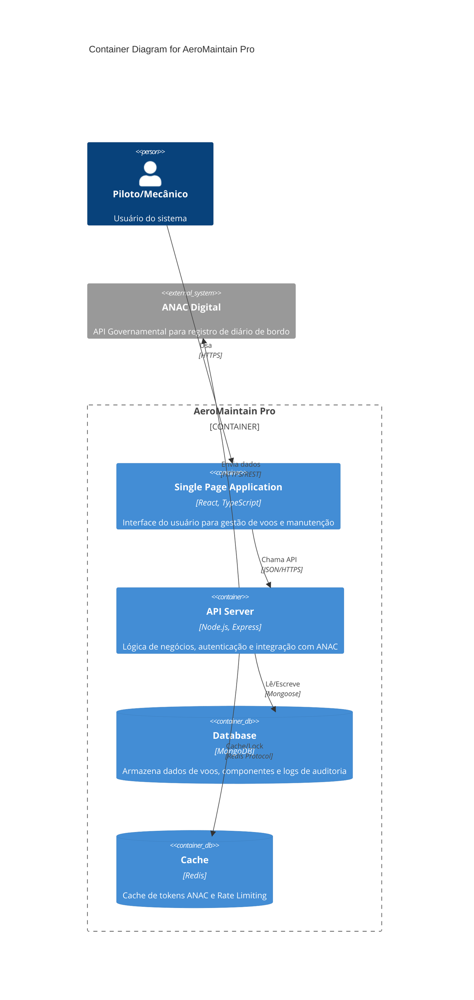

# 03/2026 - AeroMaintain Pro (React + Node.js + Clean Architecture)

**Sistema Integrado de Gestão de Manutenção Aeronáutica e Diário de Bordo Digital**

> Uma solução Full Stack robusta para conformidade regulatória (ANAC), gestão de aeronaves e auditoria de manutenção, desenvolvida com foco em segurança, escalabilidade e experiência do usuário.

---

## 🚀 Destaques Técnicos

Este projeto demonstra competências avançadas em desenvolvimento de software, ideal para avaliar habilidades em cenários do mundo real:

*   **Arquitetura Sólida**: Separação clara de responsabilidades (Routes → Controllers → Services → Models) com injeção de dependências e padrões de design escaláveis.
*   **Segurança em Primeiro Lugar**: Implementação de RBAC (Role-Based Access Control), proteção contra CSRF, Rate Limiting, Helmet para headers seguros (CSP) e validação rigorosa de dados com Zod.
*   **Integrações Complexas**: Gateway robusto para comunicação com APIs governamentais (ANAC), garantindo idempotência e tratamento de erros resiliente.
*   **Qualidade de Código**: Cobertura de testes unitários e de integração (Vitest), pipelines de CI/CD configurados e tipagem estática rigorosa com TypeScript.
*   **UX Moderna**: Interface React responsiva com atualizações otimistas (Optimistic UI), feedback em tempo real, validações visuais e visualização de dados com Sparklines.

---

## 🏛️ Arquitetura de Software

Este projeto segue os princípios de **Clean Architecture** e **Resiliência Distribuída**.

### C4 Model: Container Diagram



### Padrões de Resiliência Implementados

*   **Circuit Breaker**: Protege o sistema contra falhas em cascata da API da ANAC. Se a API externa falhar repetidamente, o circuito "abre" e falha rápido, permitindo recuperação.
*   **Retry with Exponential Backoff & Jitter**: Tentativas de reconexão inteligentes que evitam o "Thundering Herd Problem".
*   **Distributed Caching**: Tokens de autenticação da ANAC são cacheados no Redis para suportar múltiplas instâncias do servidor (Horizontal Scaling).
*   **Fail-Safe Sync**: Se a sincronização com a ANAC falhar, o voo é salvo localmente com status `PENDING` para reprocessamento posterior (Pattern: *Guaranteed Delivery*).

---

## 🛠️ Tech Stack

### Back-end
*   **Runtime**: Node.js
*   **Framework**: Express.js
*   **Database**: MongoDB (Mongoose ODM)
*   **Cache**: Redis (Opcional, para performance)
*   **Validation**: Zod (Schema validation)
*   **Logging**: Pino (Logs estruturados)
*   **Testing**: Vitest

### Front-end
*   **Framework**: React (Vite)
*   **Language**: TypeScript
*   **Styling**: Tailwind CSS
*   **Icons**: Font Awesome
*   **State Management**: Hooks customizados com Context API
*   **Data Visualization**: Recharts (Gráficos e Sparklines)

### DevOps & Infra
*   **Containerization**: Docker & Docker Compose
*   **CI/CD**: Scripts de automação para Lint, Test e Build

---

## ✨ Funcionalidades Principais

### 1. Diário de Bordo Digital
*   Registro completo de etapas de voo (origem, destino, tempos, combustível, tripulação).
*   **Integração ANAC**: Envio automático e validação de dados regulatórios em tempo real.
*   Validação de consistência temporal e lógica operacional (ex: Pouso deve ser após Decolagem).

### 2. Gestão de Manutenção
*   Controle de componentes com cálculo automático de horas restantes (`remainingHours`).
*   Alertas de vencimento e status de saúde dos componentes (OK/CRÍTICO/VENCIDO).
*   Gestão de Diretrizes de Aeronavegabilidade (DA/AD) e Boletins de Serviço (SB).

### 3. Auditoria e Segurança
*   **Trilha de Auditoria Imutável**: Logs detalhados de todas as ações críticas com hash chains.
*   Verificação de integridade de dados para garantir não-repúdio.
*   Monitoramento de saúde do sistema (Health Checks) e métricas de API em tempo real.

---

## 📦 Como Executar

### Pré-requisitos
*   Node.js (v18+)
*   Docker (opcional, recomendado para banco de dados)

### Instalação Rápida

1.  **Clone o repositório**
    ```bash
    git clone https://github.com/usuario/aeromaintain-pro.git
    cd aeromaintain-pro
    ```

2.  **Inicie a infraestrutura (MongoDB/Redis)**
    ```bash
    docker compose -f server/docker-compose.yml up -d
    ```

3.  **Setup e Testes**
    Execute o script de CI para instalar dependências, rodar linter e testes unitários.
    ```bash
    npm install
    npm run ci
    ```

4.  **Inicie o Servidor**
    Configure o arquivo `.env` na pasta `server` (use `.env.example` como base).
    ```bash
    cd server
    npm run seed # Popula o banco com dados iniciais e usuário admin
    npm run dev
    ```

5.  **Inicie o Cliente**
    Em outro terminal:
    ```bash
    cd client
    npm run dev
    ```

6.  Acesse a aplicação: `http://localhost:5173`
    *   **Login Admin**: `admin@aeromaintain.com` / `admin123` (se usar seed)

---

## 🧪 Testes e Qualidade

O projeto possui uma suíte de testes abrangente:

*   **Unitários e Integração**: Vitest (Backend e Frontend).
    *   Rodar todos: `npm run test` na raiz.
*   **End-to-End (E2E)**: Playwright.
    *   Rodar: `cd e2e && npx playwright test`
*   **Linting**: ESLint configurado para garantir padrões de código.
    *   Rodar: `npm run lint`

---

## 🔒 Segurança e Boas Práticas

*   **Autenticação**: Suporte a login seguro, reset de senha e proteção por reCAPTCHA.
*   **Dados Sensíveis**: Gerenciamento estrito via variáveis de ambiente (`.env`).
*   **Proteção de API**: Middlewares para validação de API Keys, escopos de acesso e sanitização de dados.
*   **Observabilidade**: Logs estruturados com `pino` e rastreamento distribuído via `x-request-id`.

## 📄 Documentação da API

A documentação completa da API está disponível via Swagger UI.
Após iniciar o servidor, acesse:
`http://localhost:4000/api-docs`

---
*   **Deploy**: Configurações prontas para produção (Cookies Secure, Allowed Origins, etc).

---

## 📂 Estrutura do Projeto

*   `/server`
    *   `src/routes`: Definição de endpoints da API.
    *   `src/services`: Regras de negócio e integrações.
    *   `src/models`: Schemas do banco de dados.
*   `/client`
    *   `components`: Componentes reutilizáveis da UI.
    *   `hooks`: Lógica de estado e chamadas de API.
    *   `services`: Camada de comunicação HTTP.
